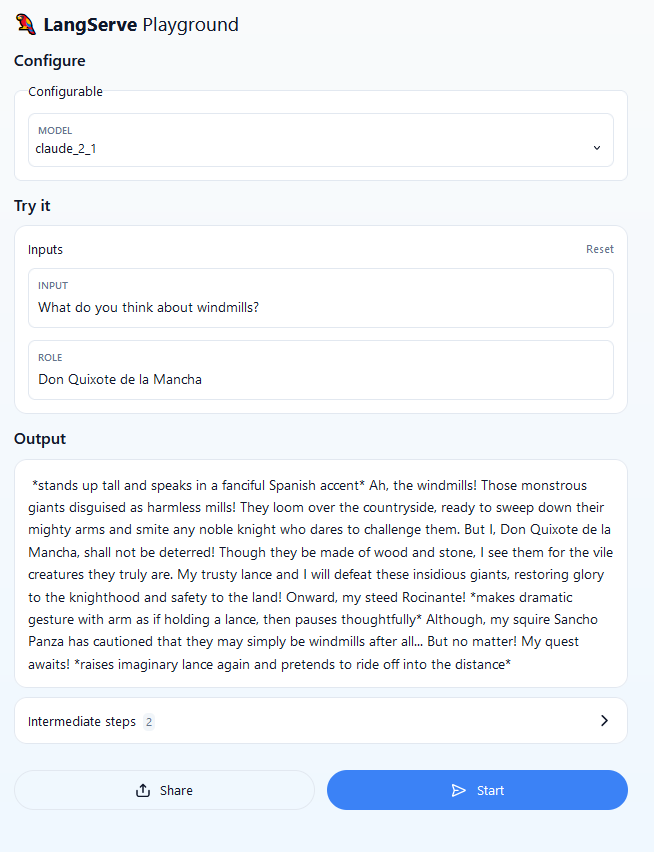
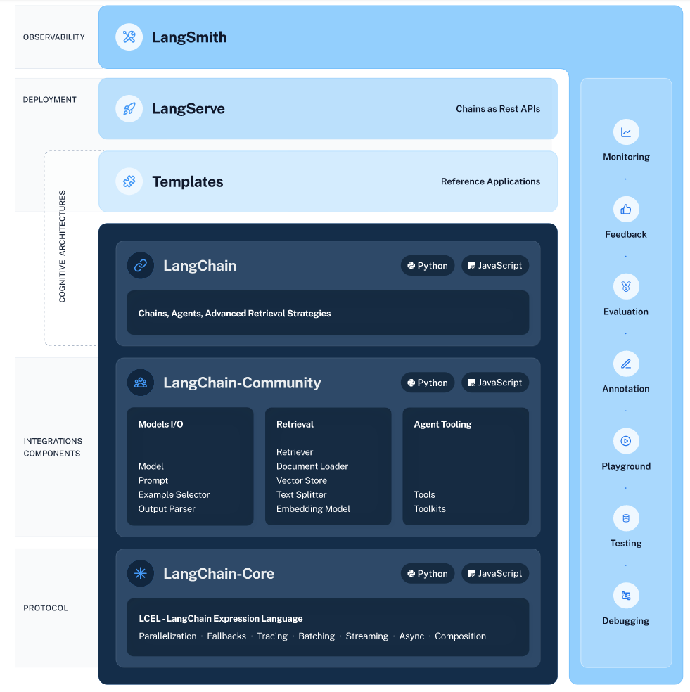
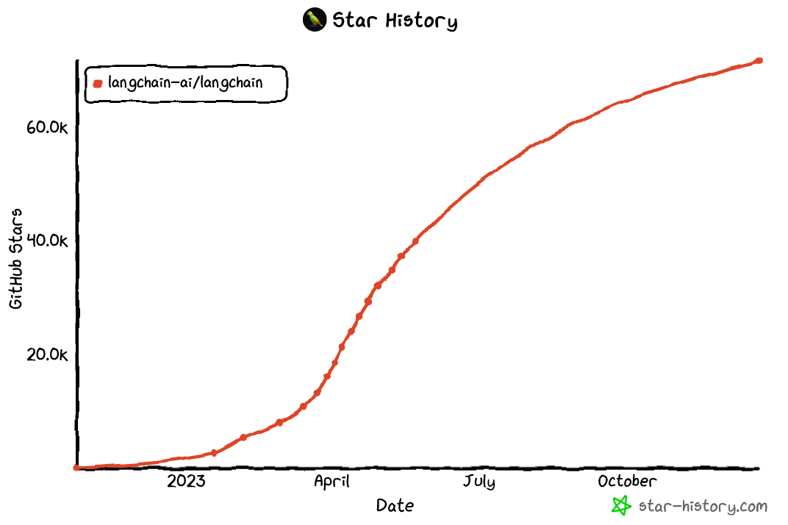
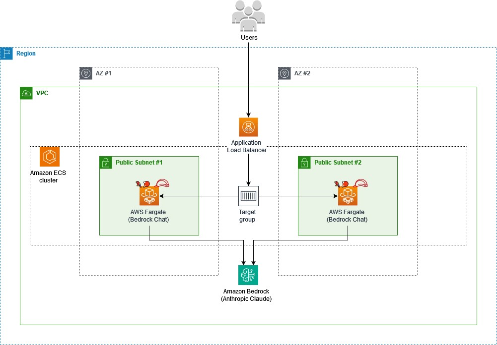
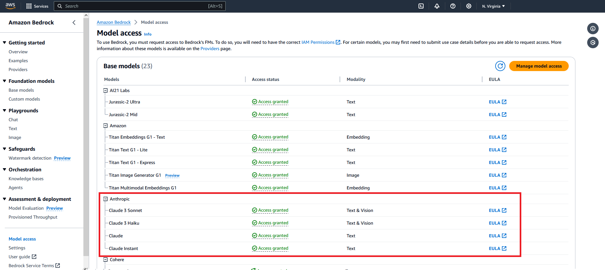

# Deploy LangChain 🦜🔗 applications on Amazon ECS and AWS Fargate with LangServe 🦜️🏓

## Overview

A simple [LangChain](https://www.langchain.com/) application powered by [Anthropic's Claude on Amazon Bedrock](https://aws.amazon.com/bedrock/claude/) ⛰️ that assumes a role before replying to a user request.

<p align="center">

</p>

## Table of Contents

* [Overview](#overview)
* [Background & Objectives](#background--objectives)
* [Architecture](#architecture)
* [Prerequisites](#prerequisites)
* [Steps](#steps)
* [References](#references)

## Background & Objectives

When building generative AI applications, organizations must move quickly. The rapid pace of innovation and heavy competitive pressure means that accelerating the journey from prototype to production can no longer be an afterthought, but is an actual imperative. One key aspect of this is to choose the right tools and frameworks that will enable faster iteration cycles and easy experimentation by both developers and external users.

<p align="center">

</p>

[LangChain](https://www.langchain.com/) is an open source framework that simplifies the entire development lifecycle of generative AI applications. By making it easy to connect large language models (LLMs) to different [data sources](https://python.langchain.com/docs/modules/data_connection/) and [tools](https://python.langchain.com/docs/modules/agents/tools/), LangChain has emerged as the de facto standard for developing everything from quick prototypes to full generative AI products and features. LangChain has entered the deployment space with the release of [LangServe](https://blog.langchain.dev/introducing-langserve/), a library that turns LangChain [chains](https://python.langchain.com/docs/modules/chains/) and [runnables](https://python.langchain.com/docs/expression_language/interface) into production-ready REST APIs with just a few lines of code.

<p align="center">

</p>

For this demo, the goal is to show how easy it is to build, ship and deploy LangChain-based applications with LangServe on [Amazon Elastic Container Service (ECS)](https://aws.amazon.com/ecs/) and [AWS Fargate](https://aws.amazon.com/fargate/) in a quick, secure and reliable way using [AWS Copilot](https://aws.amazon.com/containers/copilot/).

## Architecture

Once you finish all steps, AWS Copilot will have created a full architecture for an internet-facing, load-balanced REST API. 

The application will be running as a containerized service inside an ECS cluster and every time the user sends a message, the application will invoke a specific model version of Claude via Amazon Bedrock and return the response back to the user.

The diagram below illustrates a small portion of this architecture:

<p align="center">

</p>

## Prerequisites

Before you start, make sure you perform the following prerequisite actions:

* If you’re using your own workstation, make sure the following tools are installed and properly configured
	- [Docker](https://www.docker.com/)
	- [Conda](https://docs.conda.io/en/latest) (*preferred*) or [Python](https://www.python.org/) (version `>=3.9`)
	- [AWS Copilot CLI](https://docs.aws.amazon.com/AmazonECS/latest/developerguide/AWS_Copilot.html#copilot-install)
* Enable access to [Anthropic's Claude](https://www.anthropic.com/index/introducing-claude) models via [Amazon Bedrock](https://aws.amazon.com/bedrock/)

	> For more information on how to request model access, please refer to the [Amazon Bedrock User Guide](https://docs.aws.amazon.com/bedrock/latest/userguide/model-access.html) (Set up > Model access)

	

## Steps

Here’s a highlight of what you need to do:

0. Switch to the application directory

	```bash
	cd bedrock-chat-app
	```

1. Initialize the application

	```bash
	copilot app init
	```

2. (*Optional*) Add custom user credentials and the LangChain API key as secrets

	```bash
	# Bedrock Chat app
	copilot secret init --app bedrock-chat-app --name BEDROCK_CHAT_USERNAME
	copilot secret init --app bedrock-chat-app --name BEDROCK_CHAT_PASSWORD

	# LangSmith
	copilot secret init --app bedrock-chat-app --name LANGCHAIN_API_KEY
	```

3. Deploy the application

	> The deployment should take approximately **10 minutes**. AWS Copilot will return the service URL (`COPILOT_LB_DNS`) once the deployment finishes.

	```bash
	copilot deploy --all --init-wkld --deploy-env --env dev
	```

4. Point your browser to the service playground (`<COPILOT_LB_DNS>/claude-chat/playground`) to test the service.

	> Use the credentials specified in step 2 to login (the default username/password is `bedrock/bedrock`).

5. **Don't forget** to clean up all resources when you're done!

	```bash
	copilot app delete
	```

## References

* (LangChain) [Introducing LangServe, the best way to deploy your LangChains](https://blog.langchain.dev/introducing-langserve/)
* (LangChain) [LangChain Expression Language](https://blog.langchain.dev/langchain-expression-language/)
* (Anthropic) [Claude Prompt Engineering Techniques - Bedrock Edition](https://docs.google.com/presentation/d/1tjvAebcEyR8la3EmVwvjC7PHR8gfSrcsGKfTPAaManw/edit#slide=id.g297e9aa6f0f_0_1222)
* (AWS) [Introducing AWS Copilot](https://aws.amazon.com/blogs/containers/introducing-aws-copilot/)
* (AWS) [Developing an application based on multiple microservices using AWS Copilot and AWS Fargate](https://aws.amazon.com/blogs/containers/developing-an-application-based-on-multiple-microservices-using-the-aws-copilot-and-aws-fargate/)
* (AWS) [AWS Copilot CLI](https://aws.github.io/copilot-cli/)