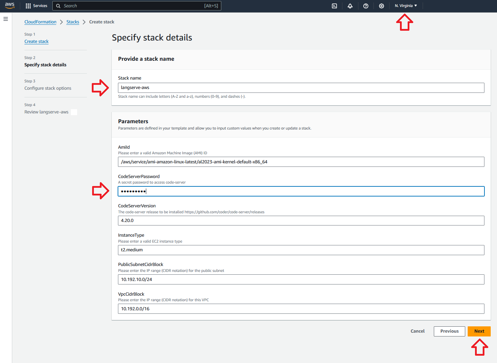
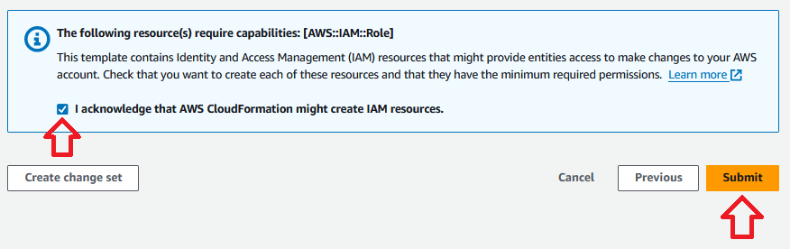

# Infrastructure (CloudFormation)

## Overview

CloudFormation Template to provision a demo environment with Conda, code-server, Docker and AWS Copilot pre-installed.

## Setup

### Deploy the CloudFormation stack

1. Click on the **Launch Stack** button to start a new deployment.

	[](https://us-east-1.console.aws.amazon.com/cloudformation/home?region=us-east-1#/stacks/create/review?templateURL=https://raw.githubusercontent.com/JGalego/deploy-langserve-aws/main/infra/cloudformation/deploy.yml&stackName=langserve-aws)

	> If the **Launch Stack** button is not working, open the CloudFormation console, click on **Create stack > With new resources (standard)**, select **Specify template > Upload a template file** in the **Create stack** section and upload the template file (`deploy.yml`) manually.

2. Fill in the **Parameters** and click **Next**.

	- Use the Region selector on the navigation bar at the top to select the **Region** you want to use to deploy the resources

	- For **Stack name**, change it to something else or use the default value (`langserve-aws`)

	- For **CodeServerPassword**, enter a secure password and store it safely (this will be used later to access Code Server)

	- For every other parameter, use the default values

	

3. In the **Configure stack options** section, leave everything unchanged and click **Next**.

4. Review all sections, check the acknowledgement boxes and choose **Create stack**.

	

	> The stack takes about **5 minutes** to deploy. Once everything is deployed, the stack will show the status `CREATE_COMPLETE`.

### Access to Code Server

1. On the AWS CloudFormation console, select the stack `langserve-on-aws` and choose the **Outputs** tab.

2. Open your web browser to the URL shown in `CodeServerUrl`.

3. Use the password specified in **Deploy the CloudFormation stack** (step 2) to login.

### Access to the instance

1. On the AWS CloudFormation console, select the stack `langserve-on-aws` and choose the **Outputs** tab.

2. Open your web browser to the URL shown in `InstanceConnectUrl` **or** copy the `InstanceId`, start a terminal session on your workstation and run the following command (don't forget to replace `<InstanceId>`)

	```bash
	aws ec2-instance-connect ssh --instance-id <InstanceId>
	```

### Cleaning up

1. Don't forget to delete the stack afterwards

	```bash
	aws cloudformation delete-stack --stack-name langserve-aws
	```